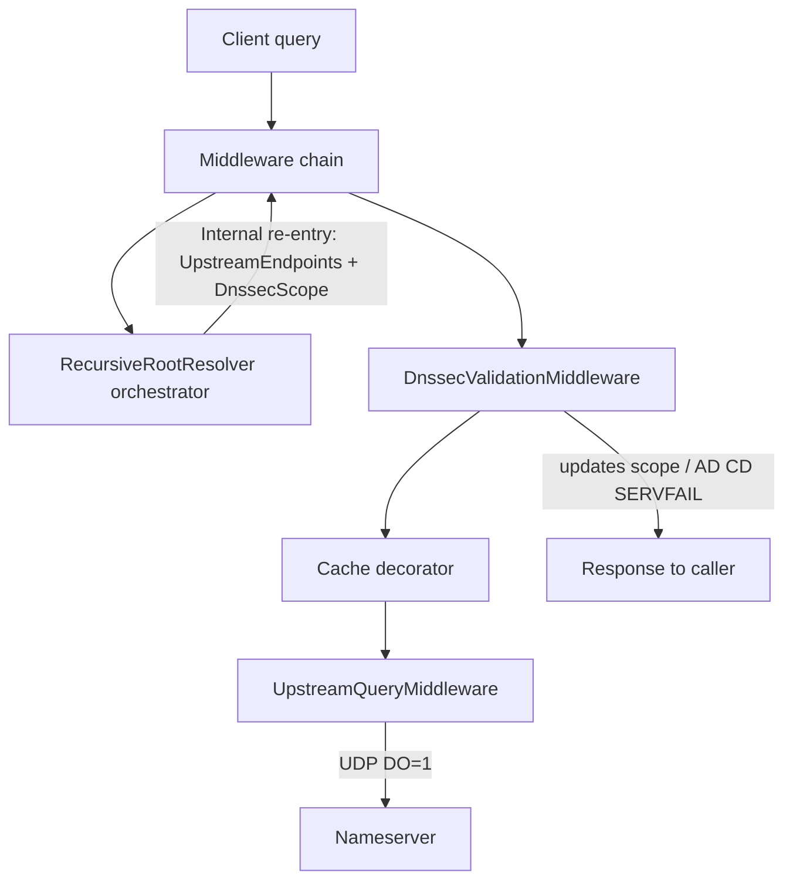

# DNSSEC implementation plan

Validating recursive DNSSEC, implemented as **middleware**. Authoritative zone signing is out of scope.

**Working rule:** implement **one phase at a time, then stop**. Do not start the next phase until the current one is merged and working.

**Phase 3 complete.** Next up: Phase 4 (Cache / CNAME).

---

## Current state

Middleware chain: RouteResolver (`RecursiveRootResolver`) → NXDOMAIN, with DNSSEC / Cache / CNAME / logging decorators. Phases 1–3 and the unified route resolver are done.

---

## Target architecture

Every authoritative hop goes through the middleware chain. Recursion only orchestrates; DNSSEC validates in a decorator.

Decorator order (outermost last):

`Logging → DnssecValidation → Cache → CanonicalName → (UpstreamQuery | RouteResolver | NameError)`

Crypto lives in an `IDnssecValidator` **service** used by middleware — parsers/crypto are not middleware themselves.

---

## Foundational: Unified Route Resolver

**Status: done.**

**Goal:** Consolidate DNS forwarding and recursion into a single routing system capable of handling both full authoritative delegations and stub forwarders seamlessly.

**Done when:**
- [x] Unified configuration `Routes` mapping domains to nameserver IPs.
- [x] Deleted `ForwardResolver` in favor of `RecursiveRootResolver` (acting as RouteResolver).
- [x] `RecursiveRootResolver` queries for `NS` and requested target type in parallel to support stub domains natively.

---

## Phase 4 — Cache / CNAME DNSSEC semantics

**Goal:** Cache and CNAME chase respect validation state.

**Done when:**

- Cache retains RRSIGs; stores security state; never serves unauthenticated data as AD
- Rules for caching upstream hops (DNSKEY / DS / NS) are explicit and tested
- CNAME decorator: AD only if every hop authenticates

**Stop here.**

---

## Phase 5 — Hardening

**Goal:** Production-ready coverage and ops knobs.

**Done when:**

- Integration tests: multi-hop signed zone (fixtures or live); AD / SERVFAIL / CD
- Config: enable/disable validation, trust-anchor list, algorithm allow/deny
- NSEC3 support (if deferred from Phase 3)
- Logging of validation failures without drowning in internal-hop noise

**Stop here.** (Further work is follow-ups, not this plan.)

---

## Out of scope

- Authoritative zone signing / key rollover / CDS / CDNSKEY
- DoT / DoH
- Blindly trusting upstream AD when forwarding

---

## Risks (carry across phases)

- Upstream-directed requests must never fall through to `RecursiveRootResolver` (infinite recursion)
- NS glue resolution must not loop on the same referral (depth / in-progress guards)
