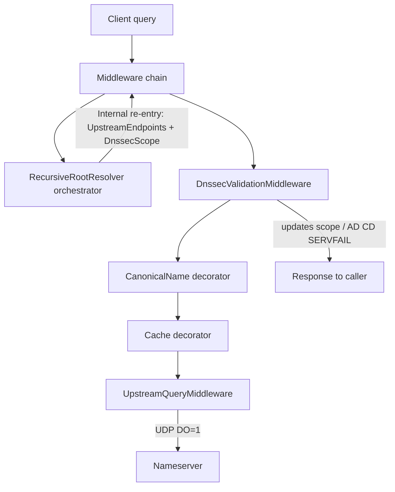

# DNSSEC implementation plan

Validating recursive DNSSEC, implemented as **middleware**. Authoritative zone signing is out of scope.

**Working rule:** implement **one phase at a time, then stop**. Do not start the next phase until the current one is merged and working. Do not mark a phase done while core Done-when items remain stubs.

**Phase 4 complete.** Next up: Phase 5 (Hardening). Do not start Phase 5 until this doc still matches the code.

---

## Current state

| Present | Gap |
|---------|-----|
| Pipeline re-entry; `UpstreamQueryMiddleware` sends DO=1; `RootZoneMiddleware` skips directed hops | Integration tests against live signed zones (Phase 5) |
| Typed DNSKEY / DS / RRSIG / NSEC / NSEC3 parsers + canonicalization | Enable/disable + algorithm allow/deny (Phase 5) |
| `IDnssecValidator` crypto + `DnssecRrsetVerifier` / `DnssecMessageValidator` | Logging of validation failures without drowning in internal-hop noise (Phase 5) |
| Trust anchors loaded into `DnssecScope` and used for DNSKEY auth | — |
| Middleware calls validator; fetches DS/DNSKEY; sets Secure/Bogus/Insecure | — |
| Client AD=1 when Secure; SERVFAIL when Bogus and CD=0 | — |
| NSEC + NSEC3 proofs for NXDOMAIN/NODATA (Opt-Out → Insecure) | — |
| Cache retains RRSIGs + security status; never serves AD from cached flags | — |
| CNAME chase keeps covering RRSIGs; AD only if every hop is Secure | — |

`RecursiveRootResolver` is roots-only label descent. Local zones and DynDNS are their own middleware — DNSSEC validation stays in the decorator, not in the recursive resolver.

---

## Target architecture

Every authoritative hop goes through the middleware chain. Recursion only orchestrates; DNSSEC validates in a decorator.

Decorator order (outermost last; matches DI):

`Shuffle → Metrics → Logging → DnssecValidation → CanonicalName → Cache → (UpstreamQuery | Forward | Recursive | …)`

Crypto lives in an `IDnssecValidator` **service** used by middleware — parsers/crypto are not middleware themselves.

---

## Foundational: Separate Forward + Recursive Resolvers

**Status: done.**

**Goal:** Keep conditional forwarding and internet recursion on separate middleware paths.

**Done when:**
- [x] `DNS:Routes` maps domain suffixes to forwarder endpoints (longest-suffix match).
- [x] `ForwardResolver` (priority 500) handles route matches via directed upstream queries.
- [x] `RecursiveRootResolver` (priority 5000) is roots-only sequential NS descent from `RootServers`.

---

## Phase 1 — Re-enter the pipeline for all internal queries

**Status: done.**

**Goal:** Every recursive hop (NS, referral, answer) and missing-glue lookup goes through the middleware chain via `InternalDomainClient`. No DNSSEC validation yet.

**Done when:**
- [x] `DomainMessageContext` has `UpstreamEndpoints` (and later `DnssecScope`)
- [x] `InternalDomainClient` can send with upstream endpoints (and scope)
- [x] `UpstreamQueryMiddleware` — when `UpstreamEndpoints` is set, query those nameservers; otherwise pass (`null`)
- [x] Forward / Recursive return `null` immediately when `UpstreamEndpoints` is set
- [x] `RecursiveRootResolver` uses only internal re-entry — no direct UDP
- [x] Missing NS glue: normal internal `A`/`AAAA` (no `UpstreamEndpoints`)
- [x] Prefer in-message glue when present
- [x] Recursion still resolves correctly end-to-end

**Stop here.**

---

## Phase 2 — Protocol foundation

**Status: done.**

**Goal:** Wire-accurate types for EDNS and DNSSEC RRs (needed before validation).

**Done when:**

- [x] Typed EDNS(0) OPT RR with DO bit; encode/decode tests
- [x] `UpstreamQueryMiddleware` attaches DO=1 on outbound queries
- [x] UDP reply size uses client OPT payload size
- [x] Record types + parsers: DNSKEY, DS, RRSIG, NSEC, NSEC3, NSEC3PARAM
- [x] `StartOfAuthorityData` includes MNAME / RNAME
- [x] Canonicalization helpers (RFC 4034 §6) with unit tests

**Stop here.**

---

## Phase 3 — Validator + DnssecValidationMiddleware

**Status: done.**

**Goal:** Local validation on middleware hops; set AD / honor CD / SERVFAIL.

**Done when:**

- [x] Trust anchors **exist** in DNS config (default root DS)
- [x] Trust anchors **loaded and used** at runtime for chain-of-trust
- [x] `IDnssecValidator` with BCL crypto: RSASHA256 (8), ECDSAP256SHA256 (13); NSEC/NSEC3 helpers
- [x] Basic unit tests with known signature / keytag / DS / NSEC vectors
- [x] `DnssecScope` created per client query, passed on every re-entry
- [x] Middleware strips upstream AD (do not copy forwarder / recursive upstream AD)
- [x] Client-facing: CD=0 + Bogus → SERVFAIL; Secure → AD=1
- [x] Middleware **calls** `DnssecMessageValidator` / `IDnssecValidator`
- [x] Upstream hops: validate RRsets into scope (`Secure` / `Insecure` / `Bogus`)
- [x] Fetch / authenticate DNSKEY and DS along zone cuts (chain of trust from trust anchors)
- [x] Scope tracks authenticated keys / delegations (not only a status enum)
- [x] NSEC proofs for NXDOMAIN / NODATA
- [x] NSEC3 proofs (closest encloser, NODATA, Opt-Out → Insecure)
- [x] Real Secure / Bogus / Insecure outcomes so AD / SERVFAIL branches fire

**Stop here.**

---

## Phase 4 — Cache / CNAME DNSSEC semantics

**Status: done.**

**Goal:** Cache and CNAME chase respect validation state.

**Done when:**

- [x] Cache retains RRSIGs; stores security state; never serves unauthenticated data as AD
- [x] Rules for caching upstream hops (DNSKEY / DS / NS) are explicit and tested
- [x] CNAME decorator: AD only if every hop authenticates (shared `DnssecScope`; covering RRSIGs kept)

**Stop here.**

---

## Phase 5 — Hardening

**Goal:** Production-ready coverage and ops knobs.

**Done when:**

- Integration tests: multi-hop signed zone (fixtures or live); AD / SERVFAIL / CD
- Config: enable/disable validation, trust-anchor list, algorithm allow/deny
- Logging of validation failures without drowning in internal-hop noise

**Stop here.** (Further work is follow-ups, not this plan.)

---

## Out of scope

- Authoritative zone signing / key rollover / CDS / CDNSKEY
- DoT (DNS-over-HTTP server: RFC 8484 `POST`/`GET` `/dns-query` on the ASP.NET host)
- Blindly trusting upstream AD when forwarding

---

## Risks (carry across phases)

- Upstream-directed requests must never fall through to `RecursiveRootResolver` (infinite recursion)
- NS glue resolution must not loop on the same referral (depth / in-progress guards)
- Do not put DNSSEC / zone / DynDNS logic into `RecursiveRootResolver` — it only walks labels from root tips
- Do not mark a phase done while core Done-when items remain stubs
