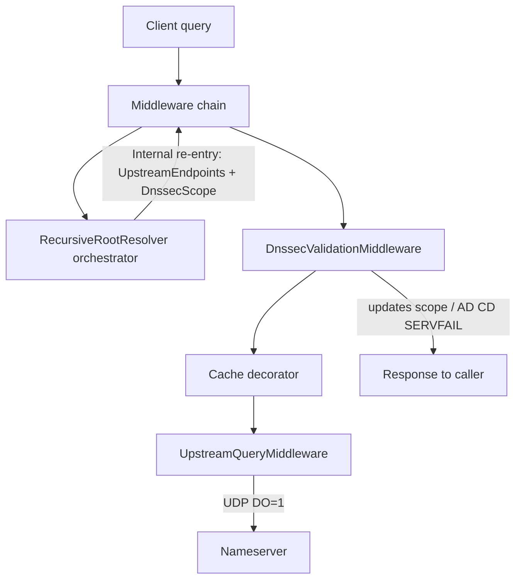

# DNSSEC implementation plan

Validating recursive DNSSEC, implemented as **middleware**. Authoritative zone signing is out of scope.

**Working rule:** implement **one phase at a time, then stop**. Do not start the next phase until the current one is merged and working.

**Phase 1 complete.** Next up: Phase 2 (protocol foundation).

---

## Current state

Middleware chain: Forward → Recursive → NXDOMAIN, with Cache / CNAME / logging decorators.

| Already present | Gap |
|-----------------|-----|
| AD / CD header bits (unused for validation) | No EDNS DO bit |
| `OPT = 41` enum value | OPT falls through to `BlobData` |
| Unknown RRs as `BlobData` | No DNSKEY / DS / RRSIG / NSEC / NSEC3 |
| `InternalDomainClient` re-enters MW for glue / CNAME | Recursive NS / referral / answer uses **direct UDP** |
| — | SOA RDATA missing MNAME / RNAME |

---

## Target architecture

Every authoritative hop goes through the middleware chain. Recursion only orchestrates; DNSSEC validates in a decorator.

Decorator order (outermost last):

`Logging → DnssecValidation → Cache → CanonicalName → (UpstreamQuery | Forward | Recursive | NameError)`

Crypto lives in an `IDnssecValidator` **service** used by middleware — parsers/crypto are not middleware themselves.

---

## Phase 1 — Re-enter the pipeline for all internal queries

**Status: done.**

**Goal:** Every recursive hop (NS, referral, answer) and missing-glue lookup goes through the middleware chain via `InternalDomainClient`. No DNSSEC validation yet. No requirement for typed DNSSEC RRs or EDNS DO in this phase (UDP queries work as today).

**Done when:**

- [x] `DomainMessageContext` has `UpstreamEndpoints` (optional placeholder for later `DnssecScope`)
- [x] `InternalDomainClient` can send with upstream endpoints (and later scope)
- [x] `UpstreamQueryMiddleware` — when `UpstreamEndpoints` is set, query those nameservers over UDP/TCP (existing clients) and return the response; otherwise pass (`null`)
- [x] `ForwardResolver` / `RecursiveRootResolver` return `null` immediately when `UpstreamEndpoints` is set (UpstreamQuery owns the hop)
- [x] `RecursiveRootResolver` uses **only** internal re-entry — no direct `GetParallelDomainClient` UDP
- [x] Removed from `RecursiveRootResolver`:
  - `CacheReferralAsNs`
  - `GetCachedNameserverAddresses`
  - direct `_cache` use in `QueryNsAsync` (Cache decorator covers re-entered queries)
- [x] Missing NS glue: normal internal `A`/`AAAA` (no `UpstreamEndpoints`) — same path a client uses
- [x] Prefer in-message glue when present
- [x] Recursion still resolves correctly end-to-end

**Stop here.**

---

## Phase 2 — Protocol foundation

**Goal:** Wire-accurate types for EDNS and DNSSEC RRs (needed before validation).

**Done when:**

- [x] Typed EDNS(0) OPT RR with DO bit; encode/decode tests
- [x] `UpstreamQueryMiddleware` attaches DO=1 on outbound queries
- [x] UDP reply size uses client OPT payload size (replace `1024` hardcode)
- [ ] Record types + parsers: DNSKEY, DS, RRSIG, NSEC, NSEC3, NSEC3PARAM
- [ ] `StartOfAuthorityData` includes MNAME / RNAME
- [ ] Canonicalization helpers (RFC 4034 §6) with unit tests

**Stop here.**

---

## Phase 3 — Validator + DnssecValidationMiddleware

**Goal:** Local validation on middleware hops; set AD / honor CD / SERVFAIL.

**Done when:**

- Trust anchors in DNS config (default root DS)
- `IDnssecValidator` with BCL crypto: RSASHA256 (8), ECDSAP256SHA256 (13); NSEC proofs (NSEC3 can wait)
- `DnssecScope` created per client query, passed on every re-entry
- `DnssecValidationMiddleware` decorator:
  - Upstream hops: validate into scope
  - Client-facing: set AD; CD=1 returns data if bogus; CD=0 + bogus → SERVFAIL
  - Do not copy forwarder upstream AD
- Basic unit tests with known signature vectors

**Stop here.**

---

## Phase 4 — Cache / CNAME DNSSEC semantics

**Goal:** Cache and CNAME chase respect validation state.

**Done when:**

- Cache retains RRSIGs; stores security state; never serves unauthenticated data as AD
- Rules for caching upstream hops (DNSKEY / DS / NS) are explicit and tested
- CNAME decorator: AD only if every hop authenticates

**Stop here.**

---

## Phase 5 — Hardening

**Goal:** Production-ready coverage and ops knobs.

**Done when:**

- Integration tests: multi-hop signed zone (fixtures or live); AD / SERVFAIL / CD
- Config: enable/disable validation, trust-anchor list, algorithm allow/deny
- NSEC3 support (if deferred from Phase 3)
- Logging of validation failures without drowning in internal-hop noise

**Stop here.** (Further work is follow-ups, not this plan.)

---

## Out of scope

- Authoritative zone signing / key rollover / CDS / CDNSKEY
- DoT / DoH
- Blindly trusting upstream AD when forwarding
- Replacing the message queue with sync in-process calls (optional later optimization)

---

## Risks (carry across phases)

- Upstream-directed requests must never fall through to `RecursiveRootResolver` (infinite recursion)
- NS glue resolution must not loop on the same referral (depth / in-progress guards)
- Extra enqueue per hop — profile later; fast-path internal invoke is optional
