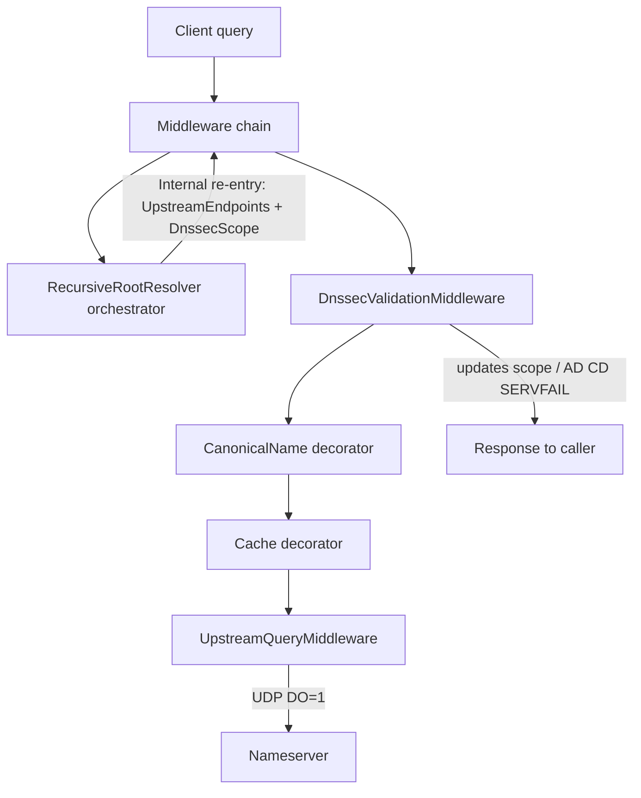

# DNSSEC implementation plan

Validating recursive DNSSEC, implemented as **middleware**. Authoritative zone signing is out of scope.

**Working rule:** implement **one phase at a time, then stop**. Do not start the next phase until the current one is merged and working. Do not mark a phase done while core Done-when items remain stubs.

**Phase 3 incomplete.** Next up: finish Phase 3 (wire validator + chain of trust). Do not start Phase 4 until Phase 3 is actually done.

---

## Current state

| Present | Gap |
|---------|-----|
| Pipeline re-entry; `UpstreamQueryMiddleware` sends DO=1 | No DS / DNSKEY fetches along the chain |
| Typed DNSKEY / DS / RRSIG / NSEC / NSEC3 parsers + canonicalization | Trust anchors in config only — never loaded into validation |
| `IDnssecValidator` crypto helpers (unit-tested) | `DnssecValidationMiddleware` injects validator and **never calls it** |
| `DnssecScope` per client query, passed on re-entry | Scope is only a `Status` enum; `Secure` / `Bogus` never set |
| Middleware strips upstream AD on every answer | AD / SERVFAIL / CD branches are dead code |
| Forward vs recursive split; DynDNS / zone middleware separate | Cache / CNAME ignore validation state (Phase 4) |

`RecursiveRootResolver` is roots-only label descent. Local zones and DynDNS are their own middleware — DNSSEC validation stays in the decorator, not in the recursive resolver.

---

## Target architecture

Every authoritative hop goes through the middleware chain. Recursion only orchestrates; DNSSEC validates in a decorator.

Decorator order (outermost last; matches DI):

`Shuffle → Metrics → Logging → DnssecValidation → CanonicalName → Cache → (UpstreamQuery | Forward | Recursive | …)`

Crypto lives in an `IDnssecValidator` **service** used by middleware — parsers/crypto are not middleware themselves.

---

## Foundational: Separate Forward + Recursive Resolvers

**Status: done.**

**Goal:** Keep conditional forwarding and internet recursion on separate middleware paths.

**Done when:**
- [x] `DNS:Routes` maps domain suffixes to forwarder endpoints (longest-suffix match).
- [x] `ForwardResolver` (priority 500) handles route matches via directed upstream queries.
- [x] `RecursiveRootResolver` (priority 5000) is roots-only sequential NS descent from `RootServers`.

---

## Phase 1 — Re-enter the pipeline for all internal queries

**Status: done.**

**Goal:** Every recursive hop (NS, referral, answer) and missing-glue lookup goes through the middleware chain via `InternalDomainClient`. No DNSSEC validation yet.

**Done when:**
- [x] `DomainMessageContext` has `UpstreamEndpoints` (and later `DnssecScope`)
- [x] `InternalDomainClient` can send with upstream endpoints (and scope)
- [x] `UpstreamQueryMiddleware` — when `UpstreamEndpoints` is set, query those nameservers; otherwise pass (`null`)
- [x] Forward / Recursive return `null` immediately when `UpstreamEndpoints` is set
- [x] `RecursiveRootResolver` uses only internal re-entry — no direct UDP
- [x] Missing NS glue: normal internal `A`/`AAAA` (no `UpstreamEndpoints`)
- [x] Prefer in-message glue when present
- [x] Recursion still resolves correctly end-to-end

**Stop here.**

---

## Phase 2 — Protocol foundation

**Status: done.**

**Goal:** Wire-accurate types for EDNS and DNSSEC RRs (needed before validation).

**Done when:**
- [x] Typed EDNS(0) OPT RR with DO bit; encode/decode tests
- [x] `UpstreamQueryMiddleware` attaches DO=1 on outbound queries
- [x] UDP reply size uses client OPT payload size
- [x] Record types + parsers: DNSKEY, DS, RRSIG, NSEC, NSEC3, NSEC3PARAM
- [x] `StartOfAuthorityData` includes MNAME / RNAME
- [x] Canonicalization helpers (RFC 4034 §6) with unit tests

**Stop here.**

---

## Phase 3 — Validator + DnssecValidationMiddleware

**Status: incomplete** (scaffolding only; marked “done” prematurely).

**Goal:** Local validation on middleware hops; set AD / honor CD / SERVFAIL.

**Done when:**

- [x] Trust anchors **exist** in DNS config (default root DS) — config validation only
- [ ] Trust anchors **loaded and used** at runtime for chain-of-trust
- [x] `IDnssecValidator` with BCL crypto: RSASHA256 (8), ECDSAP256SHA256 (13); NSEC/NSEC3 helpers
- [x] Basic unit tests with known signature / keytag / DS / NSEC vectors
- [x] `DnssecScope` created per client query, passed on every re-entry
- [x] Middleware strips upstream AD (do not copy forwarder / recursive upstream AD)
- [x] Client-facing skeleton: CD=0 + Bogus → SERVFAIL; Secure → AD=1
- [ ] Middleware **calls** `IDnssecValidator` (today `_validator` is unused)
- [ ] Upstream hops: validate RRsets into scope (`Secure` / `Insecure` / `Bogus`, not “RRSIG present → Indeterminate”)
- [ ] Fetch / authenticate DNSKEY and DS along zone cuts (chain of trust from trust anchors)
- [ ] Scope tracks authenticated keys / zone cuts (not only a status enum)
- [ ] NSEC proofs for NXDOMAIN / NODATA (NSEC3 can wait for Phase 5 if needed)
- [ ] Real Secure / Bogus outcomes so AD / SERVFAIL branches fire

**Stop here.** Do not start Phase 4 until every unchecked item above is done.

---

## Phase 4 — Cache / CNAME DNSSEC semantics

**Goal:** Cache and CNAME chase respect validation state.

**Done when:**

- Cache retains RRSIGs; stores security state; never serves unauthenticated data as AD
- Rules for caching upstream hops (DNSKEY / DS / NS) are explicit and tested
- CNAME decorator: AD only if every hop authenticates

**Stop here.**

---

## Phase 5 — Hardening

**Goal:** Production-ready coverage and ops knobs.

**Done when:**

- Integration tests: multi-hop signed zone (fixtures or live); AD / SERVFAIL / CD
- Config: enable/disable validation, trust-anchor list, algorithm allow/deny
- NSEC3 support (if deferred from Phase 3)
- Logging of validation failures without drowning in internal-hop noise

**Stop here.** (Further work is follow-ups, not this plan.)

---

## Out of scope

- Authoritative zone signing / key rollover / CDS / CDNSKEY
- DoT (DNS-over-HTTP server: RFC 8484 `POST`/`GET` `/dns-query` on the ASP.NET host)
- Blindly trusting upstream AD when forwarding

---

## Risks (carry across phases)

- Upstream-directed requests must never fall through to `RecursiveRootResolver` (infinite recursion)
- NS glue resolution must not loop on the same referral (depth / in-progress guards)
- Do not put DNSSEC / zone / DynDNS logic into `RecursiveRootResolver` — it only walks labels from root tips
- Do not mark a phase done while core Done-when items remain stubs
