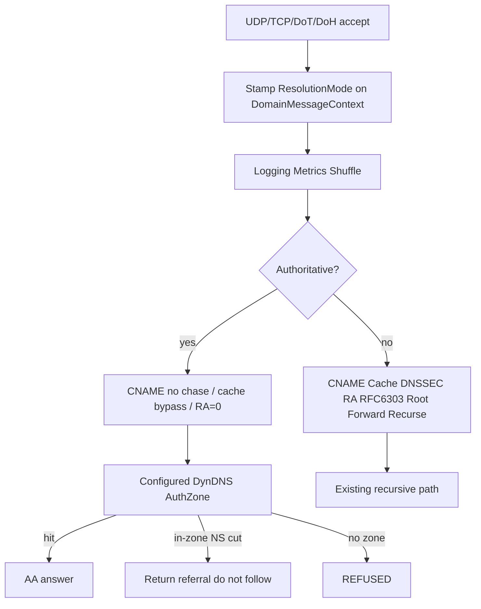

# Authoritative-only listen mode

**Status:** deferred. Do not implement until we pick this up.

Per-listen resolution mode so a socket can be a true authoritative nameserver:
local data only (zone files, `DNS:Records`, Dynamic DNS), RA=0, out-of-bailiwick
REFUSED, no recurse/forward/cache leak. Recursive listeners keep today’s onion.

One process, one onion, **mode stamped on the packet**. A recursive socket and
an auth socket can coexist. Auth never reads the shared response cache (a
recursive HIT for `google.com` must not leak onto the auth port).

## Implementation steps

Grouped in the order they should land. Each step is one commit-sized change.

### A. Parse and carry the mode

1. Add `DnsResolutionMode { Recursive, Authoritative }` and a `Mode` field on
   [`DnsListenEndpoint`](../../src/Dhcpr.Dns.Core/DnsListenEndpoint.cs)
   (default Recursive).
2. Parse `?mode=` in
   [`DnsExtensions.TryParseListenAddress`](../../src/Dhcpr.Dns.Core/DnsExtensions.cs).
   Omitted = Recursive. Unknown value fails validation.
3. TLS: accept `tls://host:853?mode=authoritative` in
   [`TlsConfiguration`](../../src/Dhcpr.Dns.Core/TlsConfiguration.cs).
   Bare `ip:port` stays Recursive.
4. Add `DNS:DOH:ResolutionMode` on
   [`DnsOverHttpConfiguration`](../../src/Dhcpr.Dns.Core/DnsOverHttpConfiguration.cs)
   (default Recursive).
5. Add `ResolutionMode` and `OffersRecursion` on
   [`DomainMessageContext`](../../src/Dhcpr.Dns.Core/Protocol/Processing/DomainMessageContext.cs).
6. Stamp the listen endpoint's mode in
   [`DnsServer`](../../src/Dhcpr.Dns.Core/Protocol/Processing/DnsServer.cs)
   UDP/TCP/TLS accept paths.
7. Stamp DoH/health from `DNS:DOH:ResolutionMode` in
   [`DnsQueryExecutor`](../../src/Dhcpr.Dns.Core/Protocol/Processing/DnsQueryExecutor.cs).
8. Copy `ResolutionMode` in
   [`InternalDomainClient`](../../src/Dhcpr.Dns.Core/Protocol/Processing/InternalDomainClient.cs)
   on Send / prefetch / refresh.

### B. Auth path behavior (same onion)

9. Early-return `_inner` when `!OffersRecursion` on Recursive, Forward,
   RootZone, Upstream, AddressPrefetch, ServFailRetry.
10. Same skip on DnssecValidation, Rfc6303, ResolverArpa, Blackhole.
11. [`RecursionAvailableMiddleware`](../../src/Dhcpr.Dns.Core/Protocol/Processing/RecursionAvailableMiddleware.cs):
    set RA only if `OffersRecursion`.
12. [`CacheResolverDecorator`](../../src/Dhcpr.Dns.Core/Resolvers/Resolvers/Recursive/CacheResolverDecorator.cs):
    skip lookup and store when Authoritative.
13. [`CanonicalNameResolverDecorator`](../../src/Dhcpr.Dns.Core/Resolvers/Resolvers/Recursive/CanonicalNameResolverDecorator.cs):
    do not chase when Authoritative.
14. [`AuthoritativeNsCutMiddleware`](../../src/Dhcpr.Dns.Core/Authoritative/AuthoritativeNsCutMiddleware.cs):
    return the referral; do not `FollowAsync`.
15. [`ServerFailureDomainMiddleware`](../../src/Dhcpr.Dns.Core/Protocol/Processing/ServerFailureDomainMiddleware.cs):
    REFUSED when Authoritative.

### C. Tests and docs

16. [`DnsListenAddressTests`](../../tests/Dhcpr.Dns.Core.UnitTests/DnsListenAddressTests.cs)
    plus TLS listener parse cases for `?mode=`.
17. Context-stamped middleware tests (no live server): out-of-zone REFUSED +
    RA=0; zone / Records / DynDNS AA + RA=0; in-zone NS cut is a referral
    (inner not invoked); shared-cache name still misses on Authoritative;
    Recursive context unchanged.
18. [`docs/dns.md`](../dns.md) and [`docs/configuration.md`](../configuration.md)
    listen / TLS / DoH examples.

## Mode on the listen URI

Default (omitted) is **Recursive** — every current `ListenAddresses` entry stays
valid.

- Classic DNS: `udp://0.0.0.0:5353?mode=authoritative` (also
  `interface://enp2s0:53/?mode=authoritative`)
- `mode=recursive` is explicit same-as-default
- Unknown `mode` fails
  [`DnsExtensions.TryParseListenAddress`](../../src/Dhcpr.Dns.Core/DnsExtensions.cs)
  / `DNS:ListenAddresses` validation

DoT / DoH are not `udp://` URIs today:

- **DoT:** parse `TLS:Listeners` as `tls://host:853?mode=authoritative` (keep
  bare `ip:port` as Recursive for compat)
- **DoH / health:**
  [`DnsQueryExecutor`](../../src/Dhcpr.Dns.Core/Protocol/Processing/DnsQueryExecutor.cs)
  stamps `DNS:DOH:ResolutionMode` (default Recursive). Health checks use that
  same executor — an all-auth box should set the DoH/health mode to
  Authoritative and probe an in-zone name

## Stamp and copy

[`DomainMessageContext`](../../src/Dhcpr.Dns.Core/Protocol/Processing/DomainMessageContext.cs)
gets `ResolutionMode` (default Recursive).

Set it where the socket is known:

- [`DnsServer`](../../src/Dhcpr.Dns.Core/Protocol/Processing/DnsServer.cs)
  UDP/TCP/TLS accept — pass mode from the `DnsListenEndpoint` that opened the
  socket into `CreateContextAndQueueForProcessing`
- DoH via `DnsQueryExecutor`

[`InternalDomainClient`](../../src/Dhcpr.Dns.Core/Protocol/Processing/InternalDomainClient.cs)
must copy `ResolutionMode` onto every hop (including prefetch/refresh). Auth
CNAME/internal re-entry stays auth; it must not “escape” into recursion.

## Same onion, auth layers go inert

Do **not** register a second Scrutor chain. `Decorate<IDomainMessageMiddleware, T>`
would wrap both.

Each recursive/resolver layer returns `_inner` immediately when
`context.ResolutionMode is Authoritative`:

- [`RecursiveRootResolver`](../../src/Dhcpr.Dns.Core/Resolvers/Resolvers/Recursive/RecursiveRootResolver.cs),
  [`ForwardResolver`](../../src/Dhcpr.Dns.Core/Resolvers/Resolvers/Forwarder/ForwardResolver.cs),
  [`RootZoneMiddleware`](../../src/Dhcpr.Dns.Core/Protocol/Processing/RootZoneMiddleware.cs),
  [`UpstreamQueryMiddleware`](../../src/Dhcpr.Dns.Core/Protocol/Processing/UpstreamQueryMiddleware.cs)
- [`AddressPrefetchMiddleware`](../../src/Dhcpr.Dns.Core/Resolvers/Resolvers/Recursive/AddressPrefetchMiddleware.cs),
  [`ServFailRetryDecorator`](../../src/Dhcpr.Dns.Core/Resolvers/Resolvers/Recursive/ServFailRetryDecorator.cs)
- [`DnssecValidationMiddleware`](../../src/Dhcpr.Dns.Core/Resolvers/Resolvers/Recursive/DnssecValidationMiddleware.cs)
  (validation of others; zone signing is later)
- [`Rfc6303EmptyZoneMiddleware`](../../src/Dhcpr.Dns.Core/Protocol/Processing/Rfc6303EmptyZoneMiddleware.cs),
  [`ResolverArpaMiddleware`](../../src/Dhcpr.Dns.Core/Protocol/Processing/ResolverArpaMiddleware.cs)
  (resolver features, not zone data)
- [`BlackholeDomainMiddleware`](../../src/Dhcpr.Dns.Core/Protocol/Processing/BlackholeDomainMiddleware.cs)
  (policy NXDOMAIN, not authority)

Keep on the auth path: Logging, Metrics, Shuffle, Unsupported (NOTIMP), Bind
CHAOS, Configured records, Dynamic DNS,
[`AuthoritativeZoneMiddleware`](../../src/Dhcpr.Dns.Core/Authoritative/AuthoritativeZoneMiddleware.cs).

Helper on the context, e.g. `OffersRecursion`, so the skip is one predicate.

## Auth-specific behavior

**RA:**
[`RecursionAvailableMiddleware`](../../src/Dhcpr.Dns.Core/Protocol/Processing/RecursionAvailableMiddleware.cs)
sets `RecursionAvailable` only when the context offers recursion. Auth replies
are RA=0 even if the client set RD.

**Cache:**
[`CacheResolverDecorator`](../../src/Dhcpr.Dns.Core/Resolvers/Resolvers/Recursive/CacheResolverDecorator.cs)
skips **lookup and store** when Authoritative. Shared
[`IDnsResponseCache`](../../src/Dhcpr.Dns.Core/Resolvers/Caching/DnsResponseCache.cs)
would otherwise serve a recursive entry on the auth port. Zone / Records /
DynDNS already set `DoNotCacheResponse`; the lookup skip is the load-bearing
part.

**CNAME:**
[`CanonicalNameResolverDecorator`](../../src/Dhcpr.Dns.Core/Resolvers/Resolvers/Recursive/CanonicalNameResolverDecorator.cs)
does not chase in Authoritative mode.
[`ZoneAnswerEngine`](../../src/Dhcpr.Dns.Core/Authoritative/ZoneAnswerEngine.cs)
already returns the CNAME RRset with AA. Client (or a recursive listener)
chases.

**NS cuts:**
[`AuthoritativeNsCutMiddleware`](../../src/Dhcpr.Dns.Core/Authoritative/AuthoritativeNsCutMiddleware.cs)
today **follows** the cut (`ReferralWalker.FollowAsync`). In Authoritative mode
it **returns the referral** (`ZoneAnswerKind.Referral`: AA=0, NS + glue) and
does not query the child. Local child zones still win via
[`AuthoritativeZoneMiddleware`](../../src/Dhcpr.Dns.Core/Authoritative/AuthoritativeZoneMiddleware.cs)
(`FindZone` walks to the most specific loaded apex) before NsCut runs.

**Miss:**
[`ServerFailureDomainMiddleware`](../../src/Dhcpr.Dns.Core/Protocol/Processing/ServerFailureDomainMiddleware.cs)
returns **REFUSED** (not SERVFAIL) when Authoritative. Out-of-bailiwick is “I am
not a resolver,” not an error. In-zone NXDOMAIN/NODATA still come from
`ZoneAnswerEngine` with AA.

Root-zone / tips hosted services stay registered: a sibling recursive listener
still needs them.

## Tests and docs (when implementing)

- [`DnsListenAddressTests`](../../tests/Dhcpr.Dns.Core.UnitTests/DnsListenAddressTests.cs):
  parse `?mode=`, reject junk
- New middleware tests (context-stamped, no live server):
  - out-of-zone → REFUSED, RA=0
  - zone / Records / DynDNS hit → AA, RA=0
  - in-zone NS cut → referral, inner/recursive not invoked
  - name present only in the shared cache → still miss on Authoritative
  - Recursive context unchanged (RA=1, recurse/forward still run)
- Docs: [`dns.md`](../dns.md), [`configuration.md`](../configuration.md), listen
  URI examples. No DHCP work in this slice.
